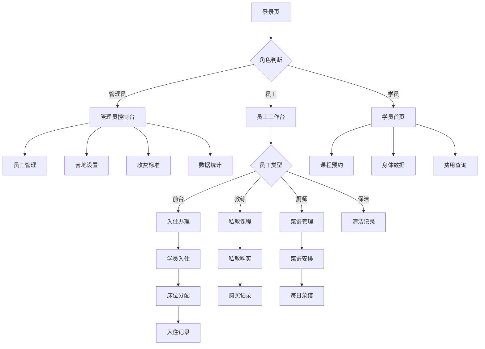

## 1. 产品概述
减肥训练营小程序是一个专为减肥训练营设计的综合管理平台，帮助管理员高效管理营地运营，员工便捷开展工作，学员获得优质训练体验。

通过数字化管理营地资源、课程安排、学员信息和收费体系，提升整体运营效率，为学员提供科学、系统的减肥训练服务。

## 2. 核心功能

### 2.1 用户角色
| 角色 | 注册方式 | 核心权限 |
|------|----------|----------|
| 管理员 | 后台创建 | 系统管理、员工管理、营地设置、收费标准制定、数据统计 |
| 教练 | 管理员创建 | 学员管理、私教课程安排、学员身体数据记录、课程签到 |
| 厨师 | 管理员创建 | 菜谱管理、每日餐食安排、食材库存管理 |
| 保洁 | 管理员创建 | 房间清洁状态更新、公共区域卫生记录 |
| 前台 | 管理员创建 | 学员入住办理、续费管理、课程预约、咨询接待 |
| 学员 | 手机号注册 | 个人信息查看、课程预约、身体数据记录、费用查询 |

### 2.2 功能模块
减肥训练营小程序包含以下主要页面：

1. **首页**：角色入口、公告通知、快捷功能入口
2. **登录注册页**：手机号登录、验证码验证、个人信息完善
3. **管理员控制台**：数据统计、员工管理、营地设置、收费标准
4. **员工工作台**：根据角色显示不同功能模块
5. **营地管理**：房间管理、床位分配、设施维护
6. **学员管理**：学员信息、入住记录、身体数据、课程记录
7. **课程管理**：私教课程安排、团体课程表、课程预约
8. **收费管理**：学费标准、续费记录、收费统计
9. **菜谱管理**：每日菜谱、营养搭配、食材管理
10. **个人中心**：个人信息、修改密码、帮助中心

### 2.3 页面详情
| 页面名称 | 模块名称 | 功能描述 |
|----------|----------|----------|
| 首页 | 角色入口 | 根据用户角色显示对应的功能入口和待办事项 |
| 首页 | 公告通知 | 显示营地公告、重要通知、活动信息 |
| 登录注册页 | 手机号登录 | 输入手机号获取验证码进行登录 |
| 登录注册页 | 个人信息完善 | 首次登录完善姓名、性别、年龄等基本信息 |
| 管理员控制台 | 数据统计 | 显示营地入住率、收入统计、学员数量等关键数据 |
| 管理员控制台 | 员工管理 | 添加、编辑、删除员工账号，分配角色权限 |
| 管理员控制台 | 营地设置 | 设置营地基本信息、房间类型、收费标准 |
| 员工工作台 | 教练工作台 | 查看负责学员、今日课程、学员身体数据录入 |
| 员工工作台 | 厨师工作台 | 今日菜谱、食材库存、餐食准备状态 |
| 员工工作台 | 前台工作台 | 学员入住办理、续费处理、课程预约管理 |
| 营地管理 | 房间列表 | 显示所有房间状态、类型、可入住人数 |
| 营地管理 | 床位分配 | 为学员分配具体床位，记录入住信息 |
| 学员管理 | 学员列表 | 显示所有学员基本信息、入住状态、联系方式 |
| 学员管理 | 身体数据 | 记录体重、体脂率、BMI等身体指标变化 |
| 学员管理 | 入住记录 | 记录每次入住时间、房间、床位、离开时间 |
| 课程管理 | 私教课程 | 安排一对一私教课程，记录课程内容和费用 |
| 课程管理 | 团体课程表 | 每日团体课程安排，支持多人预约 |
| 课程管理 | 课程预约 | 学员预约课程，教练确认预约 |
| 收费管理 | 学费标准 | 设置不同时长、不同类型的收费标准 |
| 收费管理 | 续费记录 | 记录学员续费时间、金额、有效期 |
| 收费管理 | 收费统计 | 按时间、类型统计收入情况 |
| 菜谱管理 | 每日菜谱 | 制定每日三餐菜谱，营养均衡搭配 |
| 菜谱管理 | 食材管理 | 记录食材库存、采购计划、消耗统计 |
| 个人中心 | 个人信息 | 查看和修改个人基本信息 |
| 个人中心 | 修改密码 | 修改登录密码 |

## 3. 核心流程

### 管理员流程
管理员登录后进入控制台，可以进行员工管理、营地设置、查看数据统计。设置收费标准后，前台可以根据标准为学员办理入住和续费。

### 员工流程
不同角色的员工登录后进入对应的工作台。教练可以查看学员信息、安排私教课程、记录学员身体数据；厨师管理每日菜谱；前台处理学员入住、续费和课程预约；保洁更新房间清洁状态。

### 学员流程
学员通过手机号注册登录，可以查看个人信息、预约团体课程、查看身体数据变化、查询费用情况。

## 4. 用户界面设计

### 4.1 设计风格
- **主色调**：健康绿色（#4CAF50）搭配白色背景，体现健康减肥理念
- **辅助色**：橙色（#FF9800）用于重要按钮和提醒，灰色（#9E9E9E）用于次要信息
- **按钮样式**：圆角矩形设计，主要操作按钮使用主色调，次要按钮使用边框样式
- **字体**：优先使用系统默认字体，标题16px，正文14px，辅助文字12px
- **布局风格**：卡片式布局，每个功能模块独立成卡片，清晰分隔
- **图标风格**：使用简洁的线性图标，符合微信小程序设计规范

### 4.2 页面设计概述
| 页面名称 | 模块名称 | UI元素 |
|----------|----------|--------|
| 首页 | 功能入口 | 网格布局展示功能图标，每个图标配文字说明，使用卡片容器 |
| 首页 | 公告通知 | 顶部轮播图展示重要公告，列表形式展示一般通知 |
| 登录页 | 手机号输入 | 大号输入框，清晰的国家区号选择，获取验证码按钮 |
| 管理员控制台 | 数据统计 | 卡片展示关键指标，使用图表展示趋势数据 |
| 员工工作台 | 待办事项 | 列表形式展示今日待办，支持滑动完成操作 |
| 学员管理 | 学员列表 | 头像+姓名+状态标签，支持搜索和筛选功能 |
| 课程管理 | 课程表 | 日历视图展示每日课程，时间段清晰分隔 |
| 收费管理 | 费用记录 | 列表展示缴费记录，支持按时间筛选 |
| 菜谱管理 | 每日菜谱 | 三餐分开展示，配图展示菜品，营养信息标注 |
| 个人中心 | 信息展示 | 头像+姓名+角色标签，列表形式展示功能入口 |

### 4.3 响应式设计
采用移动端优先设计，适配各种手机屏幕尺寸。使用rpx单位确保在不同设备上的显示效果，重要操作按钮放在易于点击的区域，支持滑动操作提升用户体验。