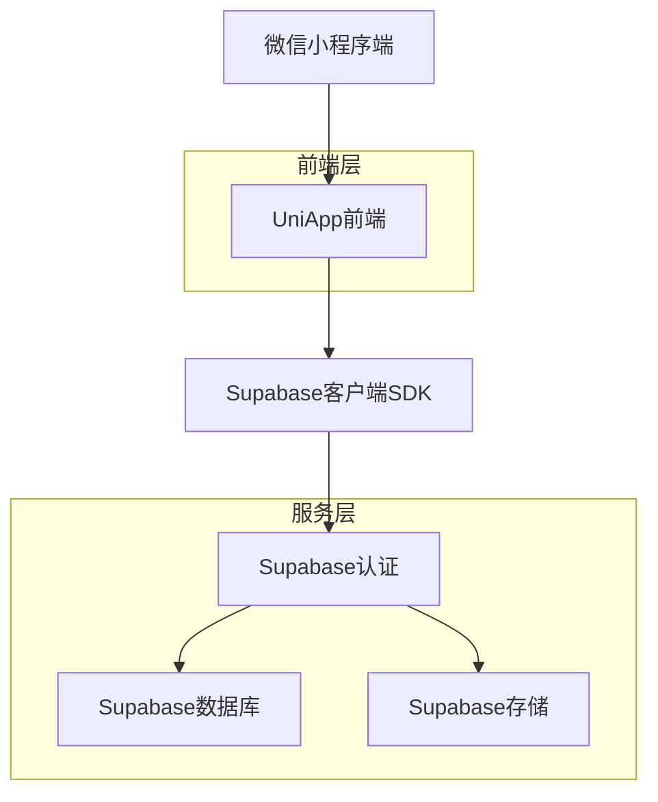
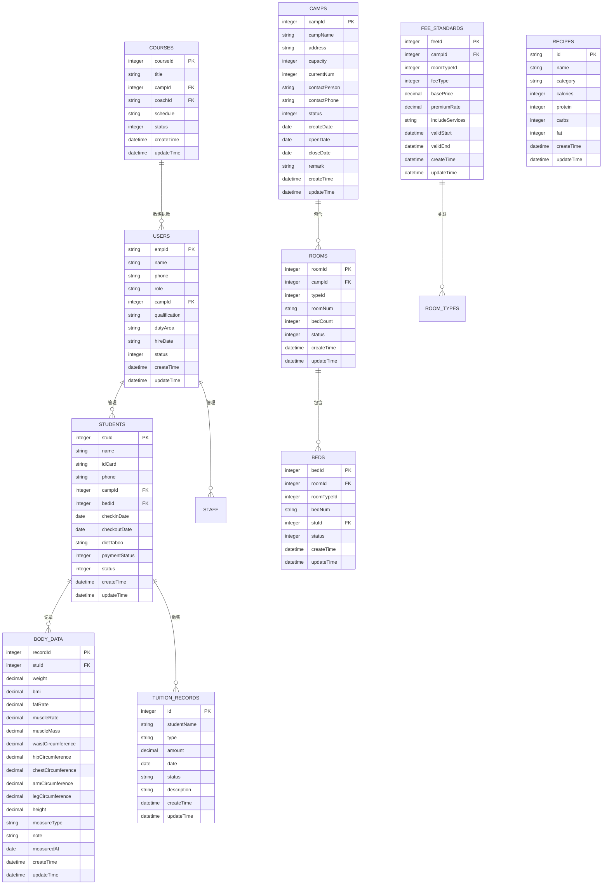

## 1. 架构设计



## 2. 技术描述

- **前端框架**: UniApp + Vue3 + TypeScript + Vite
- **初始化工具**: HBuilderX
- **后端服务**: Supabase（认证+数据库+存储）
- **状态管理**: Pinia
- **UI框架**: UniUI + 自定义组件
- **HTTP客户端**: UniApp原生请求

## 3. 路由定义

| 路由 | 用途 |
|------|------|
| /pages/index/index | 首页，根据角色显示不同入口 |
| /pages/login/login | 登录页面，手机号验证码登录 |
| /pages/admin/dashboard | 管理员控制台首页 |
| /pages/staff/workbench | 员工工作台首页 |
| /pages/student/home | 学员首页 |
| /pages/camp/room-list | 房间管理列表 |
| /pages/camp/bed-assign | 床位分配页面 |
| /pages/student/list | 学员管理列表 |
| /pages/student/body-data | 学员身体数据记录 |
| /pages/course/private-list | 私教课程列表 |
| /pages/course/group-schedule | 团体课程表 |
| /pages/course/booking | 课程预约页面 |
| /pages/fee/standard | 收费标准设置 |
| /pages/fee/renewal | 续费管理 |
| /pages/recipe/daily | 每日菜谱 |
| /pages/recipe/ingredient | 食材管理 |
| /pages/profile/index | 个人中心 |

## 4. 数据模型

### 4.1 数据模型定义 (基于 mock 数据)



### 4.2 数据定义语言 (参考 mock 字段)

用户/员工表 (users / employees)
```sql
-- 参考 employee.ts 和 userAccounts.ts
CREATE TABLE employees (
  empId VARCHAR(50) PRIMARY KEY,
  name VARCHAR(100) NOT NULL,
  phone VARCHAR(20),
  role VARCHAR(50) NOT NULL, -- '超级管理员', '教练管理员', '教练', '后勤管理员', '保洁', '营地管理员'
  campId INTEGER,
  qualification VARCHAR(255),
  dutyArea VARCHAR(255),
  hireDate DATE,
  status INTEGER DEFAULT 1,
  password VARCHAR(255), -- 存储在 userAccounts.ts 中
  createTime TIMESTAMP WITH TIME ZONE DEFAULT NOW(),
  updateTime TIMESTAMP WITH TIME ZONE DEFAULT NOW()
);
```

学员表 (students)
```sql
-- 参考 student.ts
CREATE TABLE students (
  stuId SERIAL PRIMARY KEY, -- 对应 mock 中的 1001 等
  name VARCHAR(100) NOT NULL,
  idCard VARCHAR(20),
  phone VARCHAR(20),
  campId INTEGER,
  bedId INTEGER,
  checkinDate DATE,
  checkoutDate DATE,
  dietTaboo VARCHAR(255),
  paymentStatus INTEGER, -- 1=paid?
  status INTEGER DEFAULT 1,
  createTime TIMESTAMP WITH TIME ZONE DEFAULT NOW(),
  updateTime TIMESTAMP WITH TIME ZONE DEFAULT NOW()
);
```

营地表 (camps)
```sql
-- 参考 camp.ts
CREATE TABLE camps (
  campId SERIAL PRIMARY KEY,
  campName VARCHAR(100) NOT NULL,
  address VARCHAR(255),
  capacity INTEGER,
  currentNum INTEGER,
  contactPerson VARCHAR(50), -- empId
  contactPhone VARCHAR(20),
  status INTEGER DEFAULT 1,
  createDate DATE,
  openDate DATE,
  closeDate DATE,
  remark TEXT,
  createTime TIMESTAMP WITH TIME ZONE DEFAULT NOW(),
  updateTime TIMESTAMP WITH TIME ZONE DEFAULT NOW()
);
```

房间表 (rooms)
```sql
-- 参考 room.ts
CREATE TABLE rooms (
  roomId SERIAL PRIMARY KEY,
  campId INTEGER,
  typeId INTEGER, -- 关联 room_types 或 fee_standards
  roomNum VARCHAR(50) NOT NULL,
  bedCount INTEGER,
  status INTEGER DEFAULT 1,
  createTime TIMESTAMP WITH TIME ZONE DEFAULT NOW(),
  updateTime TIMESTAMP WITH TIME ZONE DEFAULT NOW()
);
```

床位表 (beds)
```sql
-- 参考 bed.ts
CREATE TABLE beds (
  bedId SERIAL PRIMARY KEY,
  roomId INTEGER,
  roomTypeId INTEGER,
  bedNum VARCHAR(50) NOT NULL,
  stuId INTEGER, -- 可为空
  status INTEGER DEFAULT 1,
  createTime TIMESTAMP WITH TIME ZONE DEFAULT NOW(),
  updateTime TIMESTAMP WITH TIME ZONE DEFAULT NOW()
);
```

课程表 (courses)
```sql
-- 参考 course.ts
CREATE TABLE courses (
  courseId SERIAL PRIMARY KEY,
  title VARCHAR(100) NOT NULL,
  campId INTEGER,
  coachId VARCHAR(50), -- empId
  schedule VARCHAR(255),
  status INTEGER DEFAULT 1,
  createTime TIMESTAMP WITH TIME ZONE DEFAULT NOW(),
  updateTime TIMESTAMP WITH TIME ZONE DEFAULT NOW()
);
```

菜谱表 (recipes)
```sql
-- 参考 recipe.ts
CREATE TABLE recipes (
  id VARCHAR(50) PRIMARY KEY,
  name VARCHAR(100) NOT NULL,
  category VARCHAR(50), -- 'lunch', etc.
  calories INTEGER,
  protein INTEGER,
  carbs INTEGER,
  fat INTEGER,
  createTime TIMESTAMP WITH TIME ZONE DEFAULT NOW(),
  updateTime TIMESTAMP WITH TIME ZONE DEFAULT NOW()
);
```

收费标准表 (camp_fee_standards)
```sql
-- 参考 campFeeStandard.ts
CREATE TABLE camp_fee_standards (
  feeId SERIAL PRIMARY KEY,
  campId INTEGER,
  roomTypeId INTEGER,
  feeType INTEGER,
  basePrice DECIMAL(10,2),
  premiumRate DECIMAL(5,2),
  includeServices VARCHAR(255),
  validStart TIMESTAMP,
  validEnd TIMESTAMP,
  createTime TIMESTAMP WITH TIME ZONE DEFAULT NOW(),
  updateTime TIMESTAMP WITH TIME ZONE DEFAULT NOW()
);
```

学员身体数据表 (stu_body_data)
```sql
-- 参考 stuBodyData.ts
CREATE TABLE stu_body_data (
  recordId SERIAL PRIMARY KEY,
  stuId INTEGER,
  weight DECIMAL(5,2),
  bmi DECIMAL(5,2),
  fatRate DECIMAL(5,2),
  muscleRate DECIMAL(5,2),
  muscleMass DECIMAL(5,2),
  waistCircumference DECIMAL(5,2),
  hipCircumference DECIMAL(5,2),
  chestCircumference DECIMAL(5,2),
  armCircumference DECIMAL(5,2),
  legCircumference DECIMAL(5,2),
  height DECIMAL(5,2),
  measureType VARCHAR(50), -- '入营测量', '周测', '月测'
  note TEXT,
  measuredAt DATE,
  createTime TIMESTAMP WITH TIME ZONE DEFAULT NOW(),
  updateTime TIMESTAMP WITH TIME ZONE DEFAULT NOW()
);
```

学费记录表 (tuition)
```sql
-- 参考 tuition.ts
CREATE TABLE tuition (
  id SERIAL PRIMARY KEY,
  studentName VARCHAR(100), -- 冗余字段
  type VARCHAR(50), -- '学费'
  amount DECIMAL(10,2),
  date DATE,
  status VARCHAR(20), -- 'paid', 'pending'
  description TEXT,
  createTime TIMESTAMP WITH TIME ZONE DEFAULT NOW(),
  updateTime TIMESTAMP WITH TIME ZONE DEFAULT NOW()
);
```

## 5. 目录结构

```
src/
├── pages/                    # 页面文件
│   ├── index/               # 首页
│   ├── login/               # 登录页
│   ├── admin/               # 管理员相关页面
│   │   ├── dashboard/       # 控制台
│   │   ├── staff-manage/    # 员工管理
│   │   └── settings/        # 系统设置
│   ├── staff/               # 员工相关页面
│   │   ├── workbench/       # 工作台
│   │   └── profile/         # 员工信息
│   ├── student/             # 学员相关页面
│   │   ├── home/            # 学员首页
│   │   ├── profile/         # 学员信息
│   │   └── body-data/       # 身体数据
│   ├── camp/                # 营地管理
│   │   ├── room-list/       # 房间列表
│   │   ├── bed-assign/      # 床位分配
│   │   └── facility/        # 设施管理
│   ├── course/              # 课程管理
│   │   ├── private-list/    # 私教课程
│   │   ├── group-schedule/  # 团体课程表
│   │   └── booking/         # 课程预约
│   ├── fee/                 # 收费管理
│   │   ├── standard/        # 收费标准
│   │   ├── renewal/         # 续费管理
│   │   └── statistics/      # 收费统计
│   └── recipe/              # 菜谱管理
│       ├── daily/           # 每日菜谱
│       └── ingredient/      # 食材管理
├── components/              # 公共组件
│   ├── uni-ui/              # UI组件库
│   ├── charts/              # 图表组件
│   ├── calendar/            # 日历组件
│   └── form/                # 表单组件
├── utils/                   # 工具函数
│   ├── request.js           # 网络请求封装
│   ├── auth.js              # 认证相关
│   ├── date.js              # 日期处理
│   └── validate.js          # 表单验证
├── store/                   # 状态管理
│   ├── index.js             # Pinia入口
│   ├── modules/
│   │   ├── user.js          # 用户信息
│   │   ├── camp.js          # 营地信息
│   │   ├── course.js        # 课程信息
│   │   └── fee.js           # 收费信息
├── static/                  # 静态资源
│   ├── images/              # 图片资源
│   ├── icons/               # 图标资源
│   └── styles/              # 样式文件
└── App.vue                  # 应用入口
```

## 6. 关键组件设计

### 6.1 角色权限组件
- **RoleGuard**: 根据用户角色控制页面访问权限
- **MenuFilter**: 根据角色过滤显示的功能菜单
- **ActionButton**: 根据权限显示操作按钮

### 6.2 数据展示组件
- **StudentCard**: 学员信息卡片，显示头像、姓名、状态等
- **RoomStatus**: 房间状态展示，实时显示入住情况
- **CourseSchedule**: 课程表组件，支持日历视图和列表视图
- **FeeSummary**: 费用汇总组件，显示缴费状态和金额

### 6.3 表单组件
- **StudentForm**: 学员信息录入表单
- **CourseBookingForm**: 课程预约表单
- **FeePaymentForm**: 费用缴纳表单
- **BodyDataForm**: 身体数据录入表单

### 6.4 图表组件
- **WeightChart**: 体重变化趋势图
- **IncomeChart**: 收入统计图表
- **OccupancyChart**: 入住率统计图
- **CourseChart**: 课程预约统计图
