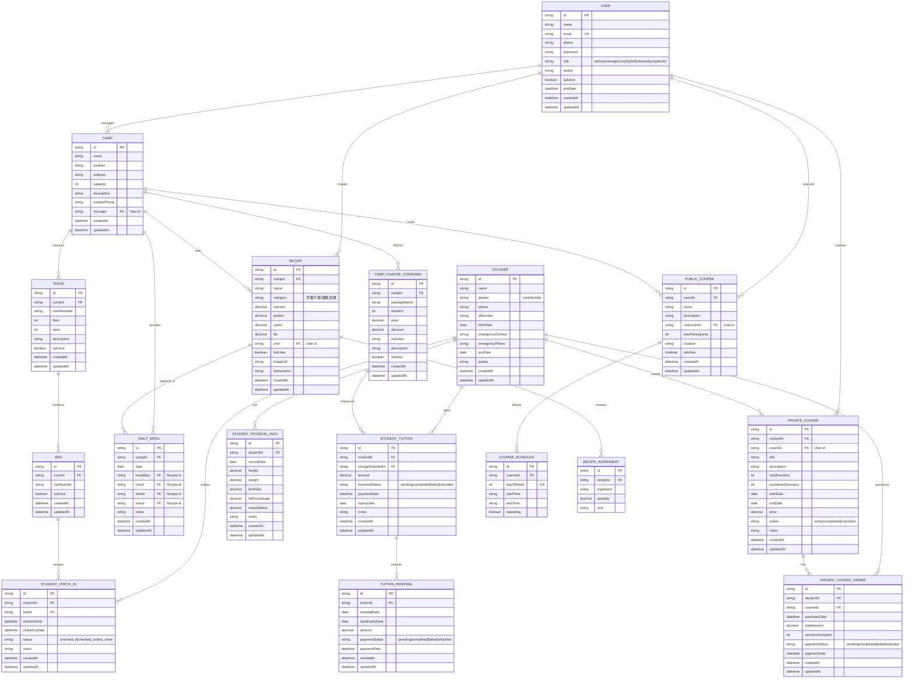
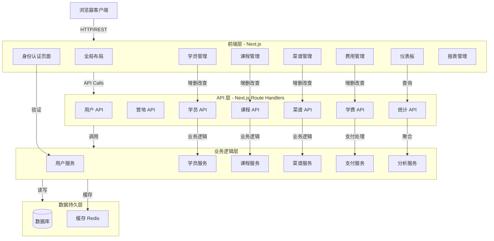
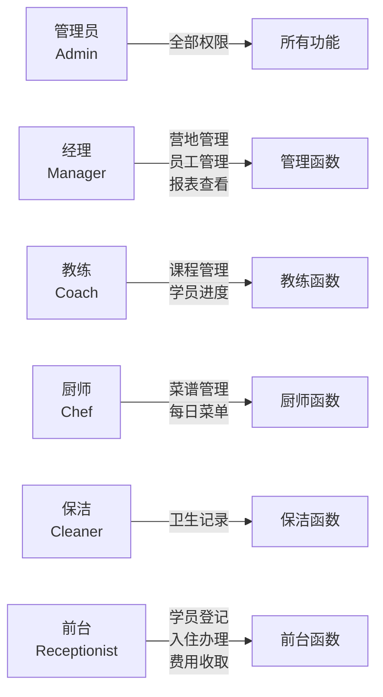
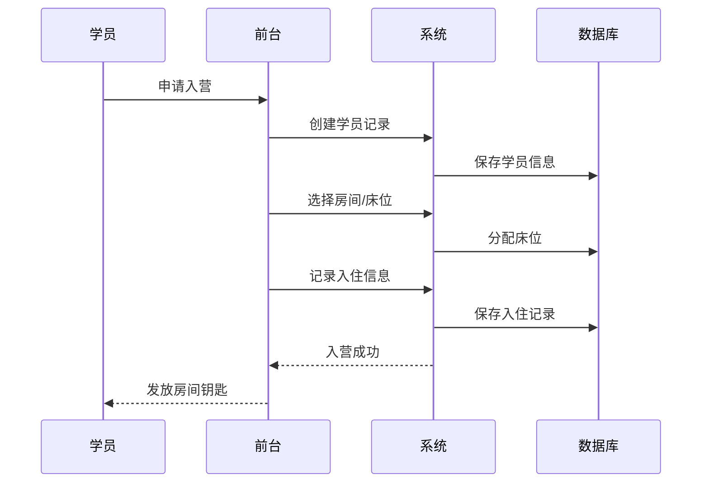
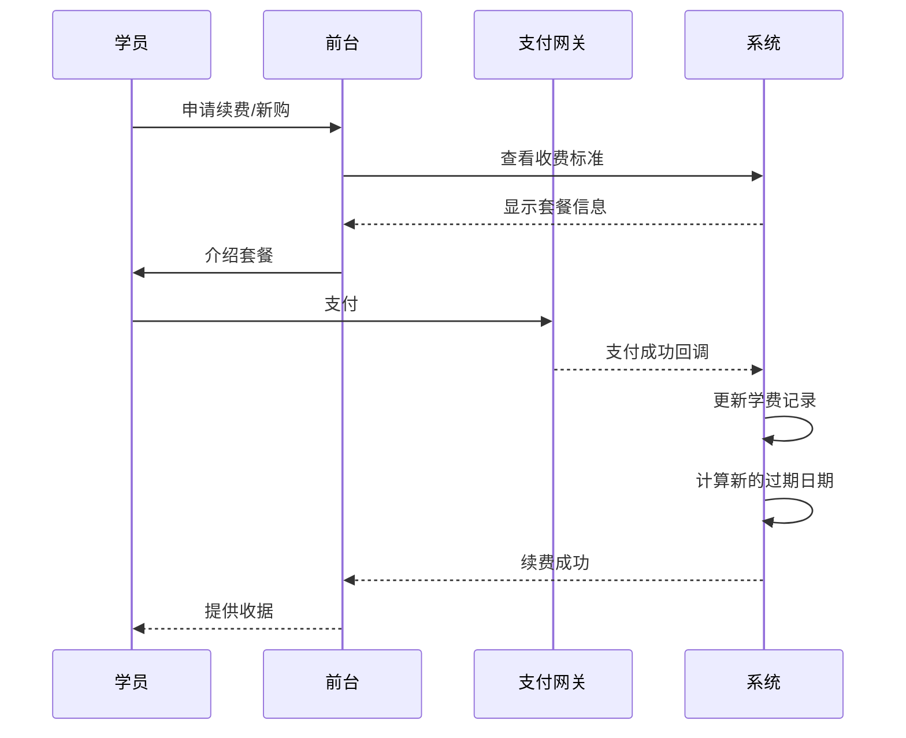
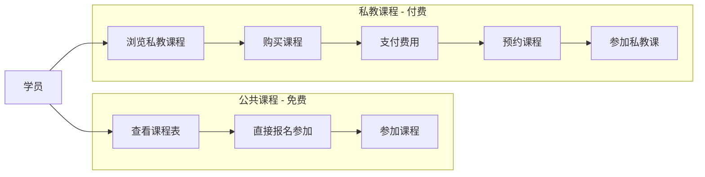

# 减肥训练营管理系统 - 架构文档

## 系统概述
这是一个完整的减肥训练营管理后台系统，支持多营地、多角色管理。

## 数据库 ER 图

## 系统架构图

## 权限矩阵

## 关键业务流程

### 1. 学员入营流程

### 2. 学费收取与续费流程

### 3. 课程参加流程

## 模块说明

### 1. 用户管理模块
- **功能**：创建、编辑、删除员工，管理员工权限
- **角色**：Admin, Manager
- **关键操作**：员工入职、权限分配、离职管理

### 2. 营地管理模块
- **功能**：多营地管理、房间管理、床位分配
- **角色**：Manager
- **关键操作**：营地信息维护、房间创建、床位状态跟踪

### 3. 学员管理模块
- **功能**：学员信息、身体数据跟踪、入住管理
- **角色**：Manager, Receptionist, Coach
- **关键操作**：
  - 学员注册与信息管理
  - 定期身体指标记录（体重、BMI、体脂率等）
  - 入住/退住管理
  - 学员状态跟踪

### 4. 课程管理模块
- **公共课程**（免费，所有人可参加）
  - 每日课程表展示
  - 固定课程时间安排
  - 参加人数统计
  - 角色：Coach 教练，Receptionist 前台
  
- **私教课程**（付费）
  - 私教课程管理
  - 课程购买与支付
  - 课时跟踪与完成情况
  - 角色：Coach, Receptionist

### 5. 菜谱与营养管理模块
- **功能**：菜谱管理、每日菜单制定、营养信息跟踪
- **角色**：Chef 厨师，Manager
- **关键操作**：
  - 菜谱数据库管理（成分、卡路里、宏观营养）
  - 每日菜单安排（与学员无直接关系）
  - 营养分析

### 6. 费用管理模块
- **功能**：学费收取、续费管理、收费标准维护
- **角色**：Receptionist, Manager
- **关键操作**：
  - 营地收费标准管理（支持多种套餐）
  - 学费收取（初次与续费）
  - 支付状态跟踪
  - 到期提醒与续费处理

### 7. 统计与报表模块
- **功能**：学员统计、营地统计、财务统计
- **角色**：Manager, Admin
- **关键指标**：
  - 学员相关：总人数、活跃人数、入住人数、平均体重、平均BMI
  - 营地相关：总床位、占用床位、入住率、收入、待收费用
  - 课程相关：课程参加率、私教销售情况
  - 费用相关：收入统计、待收费用、续费率

## 技术栈

- **前端**：Next.js 16, React 19, TypeScript, Tailwind CSS v4
- **数据库**：PostgreSQL (建议) / MongoDB
- **认证**：JWT + NextAuth.js
- **支付**：支付宝/微信支付 (集成建议)
- **缓存**：Redis (可选)
- **部署**：Vercel / 自建服务器

## API 设计原则

- RESTful API 设计
- JWT 令牌认证
- 基于角色的访问控制（RBAC）
- 请求/响应标准化
- 错误处理统一格式

## 安全考虑

1. 身份认证与授权
2. 数据加密（密码、敏感信息）
3. API 速率限制
4. SQL 注入防护
5. CORS 配置
6. 审计日志记录

## 扩展方向

1. 短信/微信通知提醒
2. 微信小程序学员端
3. 数据分析与可视化大屏
4. 人工智能健身建议
5. 设备数据集成（体脂秤、运动手环等）
