# 减肥训练营管理系统 - 完整 Mermaid 图表

## 1. 系统整体架构

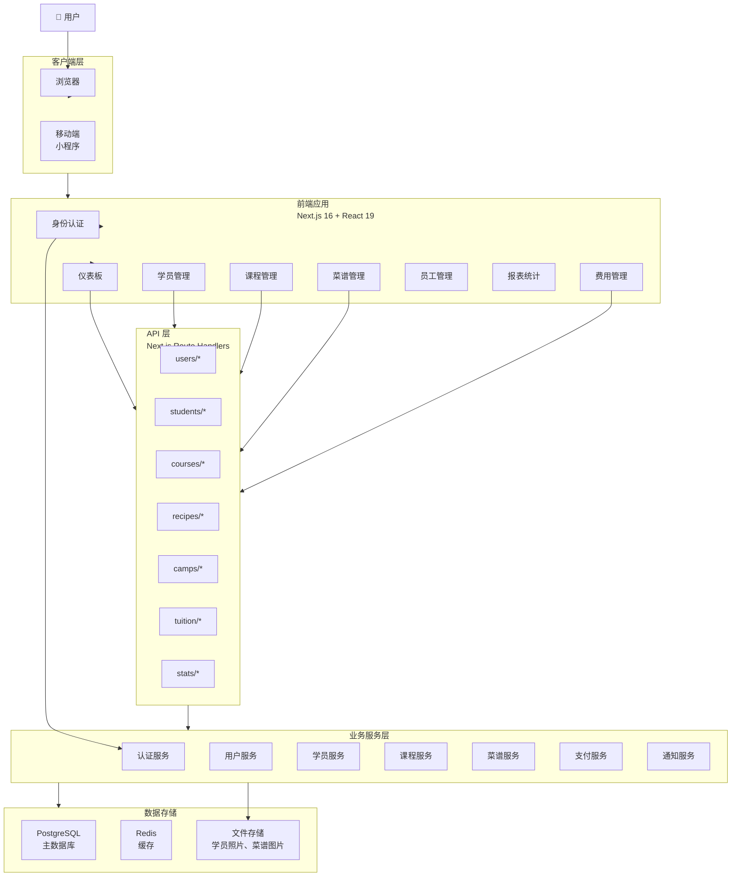

## 2. 用户权限树状结构

```mermaid
graph TD
    A["系统管理<br/>Admin"]
    B["营地经理<br/>Manager"]
    C1["教练<br/>Coach"]
    C2["厨师<br/>Chef"]
    C3["保洁<br/>Cleaner"]
    C4["前台<br/>Receptionist"]
    
    A -->|管理所有| A1["用户管理"]
    A -->|管理所有| A2["营地管理"]
    A -->|查看所有| A3["报表统计"]
    A -->|审核所有| A4["支付记录"]
    
    B -->|管理营地| B1["员工管理"]
    B -->|管理营地| B2["房间/床位"]
    B -->|查看| B3["经营报表"]
    B -->|发布| B4["菜谱审核"]
    
    C1 -->|编辑| C1A["我的课程"]
    C1 -->|记录| C1B["学员进度"]
    C1 -->|查看| C1C["学员身体数据"]
    C1 -->|预约| C1D["私教课程"]
    
    C2 -->|创建| C2A["菜谱库"]
    C2 -->|编辑| C2B["每日菜单"]
    C2 -->|查看| C2C["营养分析"]
    
    C3 -->|记录| C3A["卫生巡查"]
    C3 -->|查看| C3B["房间状态"]
    
    C4 -->|办理| C4A["学员入住"]
    C4 -->|收取| C4B["学费费用"]
    C4 -->|报名| C4C["公共课程"]
    C4 -->|预约| C4D["私教课程"]
```

## 3. 学员入营与离营流程

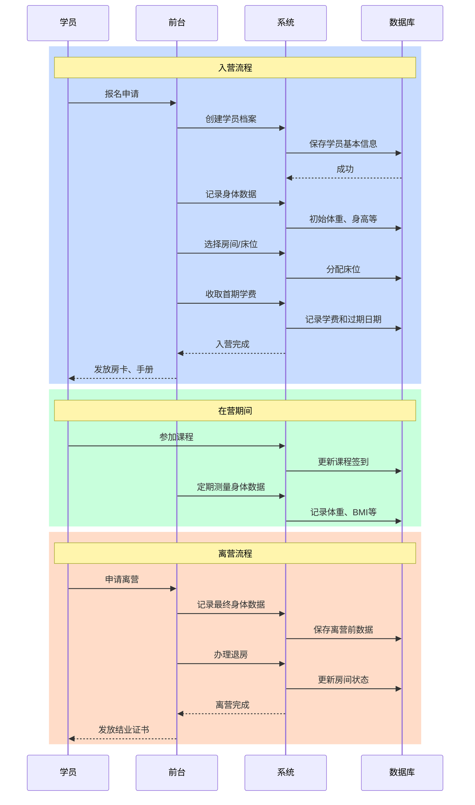

## 4. 学费与续费管理流程

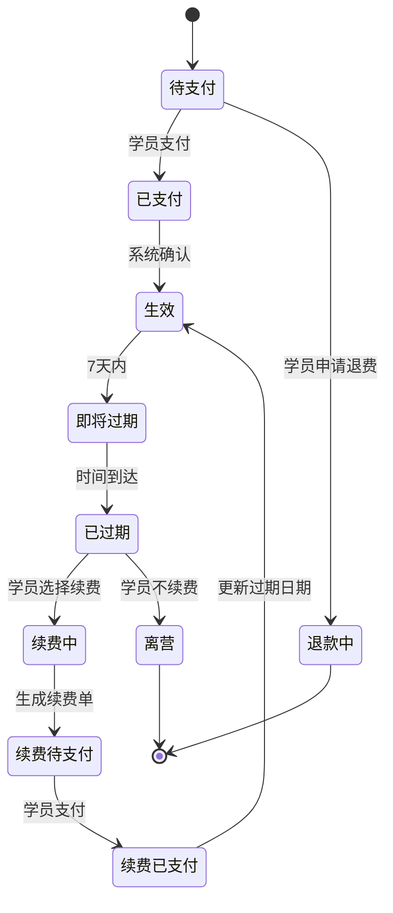

## 5. 课程参加管理

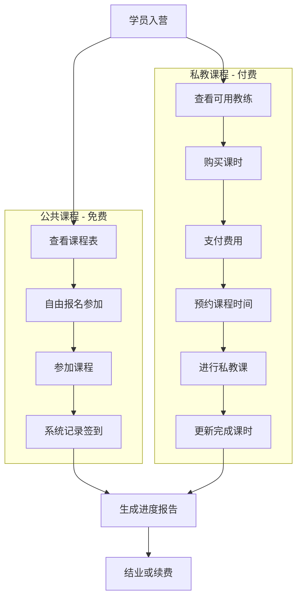

## 6. 菜谱与每日菜单系统

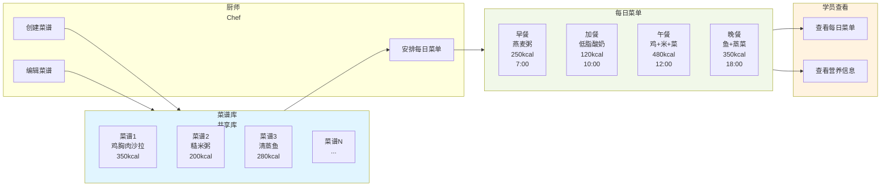

## 7. 营地床位与房间管理

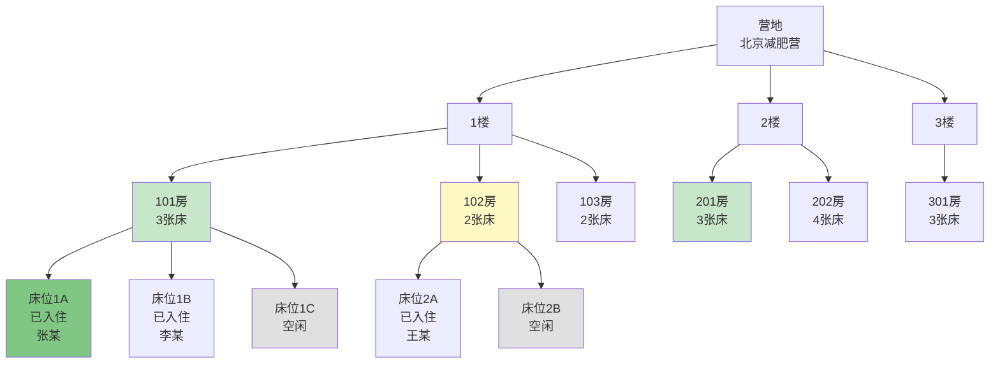

## 8. 支付与财务流程

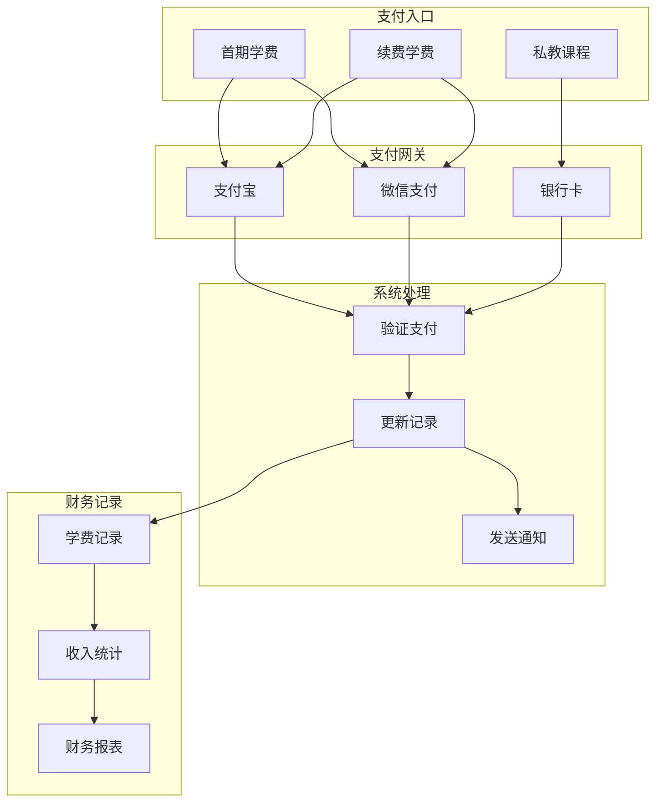

## 9. 学员身体数据追踪

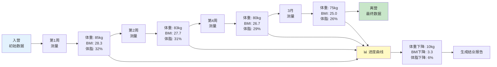

## 10. 系统统计仪表板

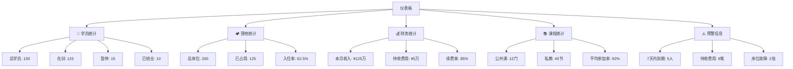

## 11. 数据库关系图（简化版）

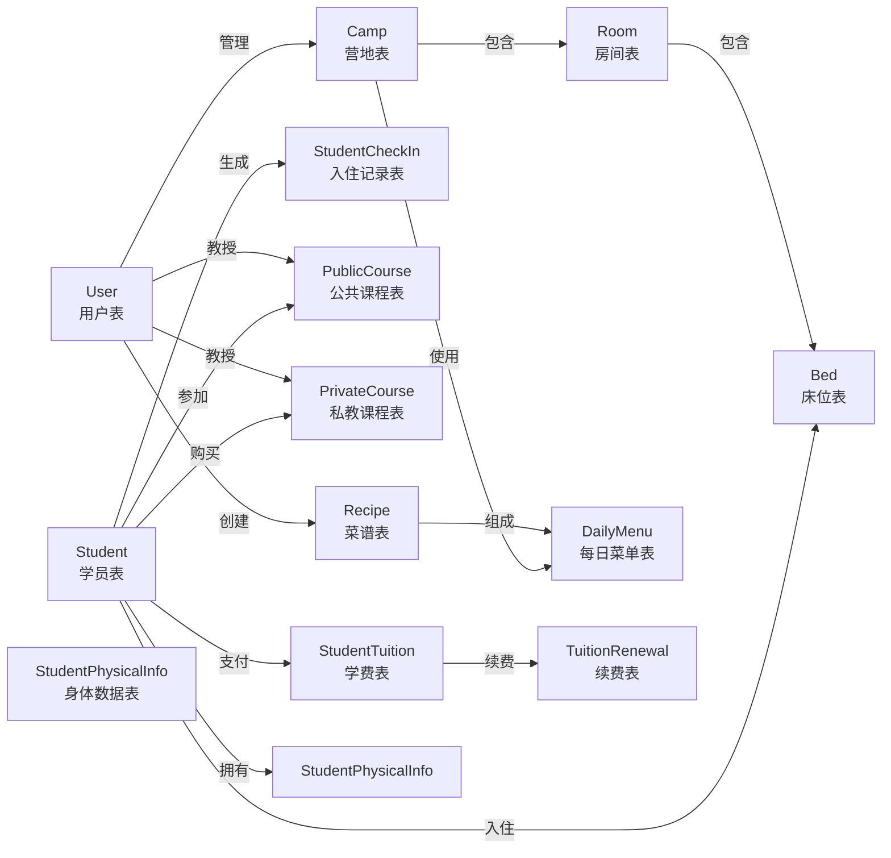

## 12. 部署架构

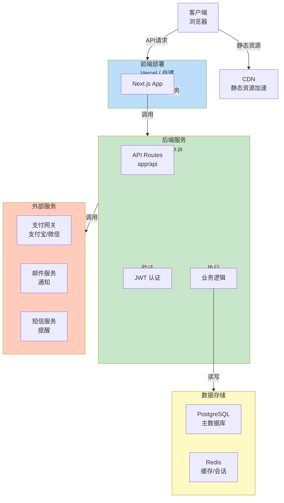

## 13. 完整用户流程图

```mermaid
stateDiagram-v2
    [*] --> 登录
    登录 --> 身份验证: 输入账号密码
    身份验证 --> 权限检查: 验证成功
    权限检查 --> 仪表板: Admin/Manager
    权限检查 --> CoachPanel: Coach
    权限检查 --> ChefPanel: Chef
    权限检查 --> ReceptionPanel: Receptionist
    
    仪表板 --> 查看统计
    查看统计 --> 管理功能
    管理功能 --> 学员管理
    管理功能 --> 营地管理
    管理功能 --> 报表统计
    
    CoachPanel --> 查看课程
    查看课程 --> 教学
    教学 --> 记录学员进度
    
    ChefPanel --> 浏览菜谱库
    浏览菜谱库 --> 创建菜谱
    创建菜谱 --> 安排菜单
    
    ReceptionPanel --> 办理入住
    办理入住 --> 收取学费
    收取学费 --> 报名课程
    报名课程 --> 其他业务
    
    学员管理 --> 记录身体数据
    记录身体数据 --> 追踪进度
    追踪进度 --> 生成报告
    
    其他业务 --> 退出登录
    生成报告 --> 退出登录
    [*] <-- 退出登录
```

---

## 图表说明

1. **系统整体架构** - 展示前端、API、服务和数据库的分层结构
2. **权限树状结构** - 不同角色的权限细分
3. **学员入营流程** - 时序图展示完整的入营、在营、离营过程
4. **学费续费管理** - 学费从待支付到离营的完整状态转移
5. **课程参加管理** - 公共课和私教课的不同流程
6. **菜谱与菜单系统** - 菜谱库和每日菜单的关系
7. **营地床位管理** - 营地层级结构和床位分配
8. **支付与财务流程** - 支付网关到财务记录的流程
9. **学员身体数据** - 长期追踪的数据和进度报告
10. **仪表板统计** - 主要的 KPI 和预警信息
11. **数据库关系图** - 所有表之间的关系
12. **部署架构** - 生产环境的系统架构
13. **用户流程** - 完整的用户操作流程

